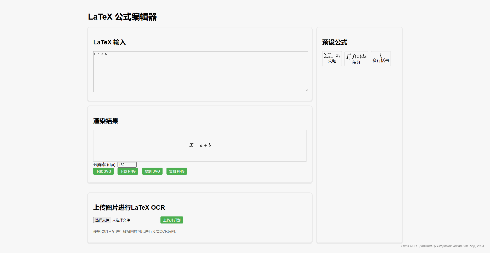
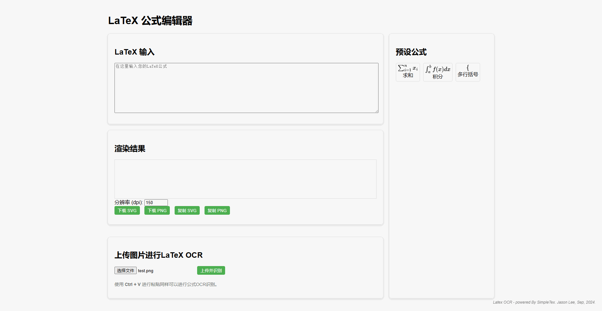

# Latex_Equation2Image_Easy2Copy
Latex Equation transfer to imag, and easy copy with OCR.

# Installation
1. `pip install -r requirements.txt`
    
    or 

    `pip install requests flask`

2. Execute `python app.py`

3. Open http://127.0.0.1:5000/ in your explorer

# Usage
1. You can enter the formula directly into the latex input box to get the result

2. You can click Upload file, upload the public image to get the OCR recognition result

3. You can invoke OCR recognition by pressing the keyboard shortcut Crtl+V to get the result

# Examples

*Use case 1: enter the formula directly*

*Use case 2: Upload file OCR*

*Use case 3: Ctrl + V paste OCR*

# PS
1. OCR tech is powered By SimpleTex API. You can visit it with the link: https://simpletex.cn/. It is still the best Latex equation OCR software I have ever used
2. Now the project can not run online, nor directly through the front-end to call the api, can only run python back-end services first, and then front-end interaction
3. I made this because SimpleTex's ads make the experience worse, and SimpleTex doesn't support the adjustment of image sharpness. In addition, many Latex editors do not have OCR recognition and cannot copy directly. If you have to download to a folder and then find it for uploading and pasting, it is inefficient in some productive environments
